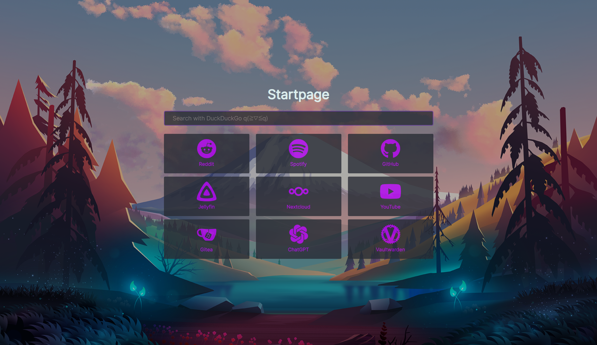

Startpage
=========

A self made startpage (inspired by various sources)

Usage
-----

* **Docker Compose**: Start a Docker Container using the `docker-compose.yml` File
* **Dockerfile**: Use the `Dockerfile` in this Repo to Build it locally

After the Container has started you can connect with [http://localhost:3000](http://localhost:3000) 
(Or replace localhost with the IP of the Server the Container is running on)

Images
---

I got the Images from a lot of those Free Wallpaper Sites.

However most of them come From the [catppuccin-wallpapers](https://github.com/zhichaoh/catppuccin-wallpapers)
and [gruvbox-wallpapers](https://github.com/AngelJumbo/gruvbox-wallpapers) Repositories.
